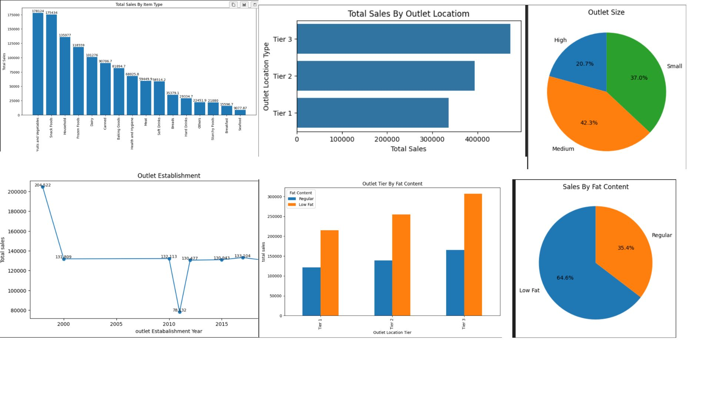

📊 Blinkit Data Analysis (Python)

🛠️ Tools & Libraries Used

- Python
- Pandas
- NumPy
- Matplotlib
- Seaborn

---

📌 Project Overview

This project analyzes Blinkit sales data using Python to uncover trends, product performance, and key business insights. The analysis helps understand how different factors like item type, outlet type, and location influence sales.

---

📷 Dashboard Preview

---

📊 Key Analysis

- Data cleaning and preprocessing
- Exploratory Data Analysis (EDA)
- Sales trend analysis
- Category and item type performance
- Outlet-wise comparison

---

📈 Key Insights

- Identified top-performing product categories
- Sales vary significantly across outlet types
- Certain locations generate higher revenue
- Customer preferences impact sales distribution

---

📁 Files Included

- "Blinkit.ipynb"
- "blinkit_data.csv"
- "Blinkit_Dashboard.jpg"

---

🚀 How to Run

1. Install required libraries:
   pip install pandas numpy matplotlib seaborn

2. Open Jupyter Notebook:
   jupyter notebook

3. Run the notebook:
   Blinkit.ipynb

---

💡 Note

Make sure the dataset file is in the same folder as the notebook:

df = pd.read_csv("blinkit_data.csv")

---

🎯 Conclusion

This project demonstrates how Python can be used for data cleaning, analysis, and visualization to generate meaningful business insights.

---
